# 🚀 Container Docker com WordPress na AWS

  
  
  
  

Este projeto utiliza a **Cloud AWS** com **WordPress** para provisionar uma página web através de containers **Docker** em instâncias **Linux**.

---

# 📚 Sumário

## ☁️ ETAPA 1: Provisionando o Ambiente AWS
- **Objetivo:** Configuração geral da AWS: **VPC**, **Grupos de Segurança**, **User Data**, **EC2**, **RDS** e **EFS**.
- **Passos principais:**
  - Criando a **VPC**
  - Criando **Grupos de Segurança**
  - Configurando o **RDS**
  - Configurando o **EFS**

## 🌐 ETAPA 2: Balanceamento de Carga 
- **Objetivo:** Configurar o acesso através do **Load Balancer**
- **Passos principais:**
  - Configurando o **Target Group**
  - Criando o **Load Balancer**

## 👨‍💻 ETAPA 3: Políticas de Escalonamento
- **Objetivo:** Configurar o escalonamento através do **Auto Scaling Group**
- **Passos principais:**
  - Criando o **Launch Template**
  - Configurando o **Auto Scaling**

## ✅ ETAPA 4: Testes
- **Objetivo:** Acessar o **WordPress** via **Load Balancer**
- **Passos principais:**
   - Acessar o projeto

---

# ☁️ ETAPA 1: Provisionando Ambiente Cloud AWS

## 1. Criando a VPC

### 1.1. Acesse a AWS e navegue até a seção **VPC**

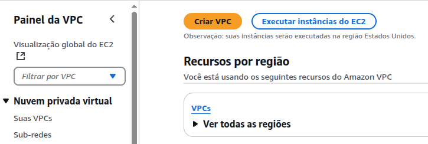

1.1.1 Clique em **Create VPC** e siga as instruções:
- Defina um **CIDR Block** (ex: `10.0.0.0/16`)
- Escolha um nome para sua VPC

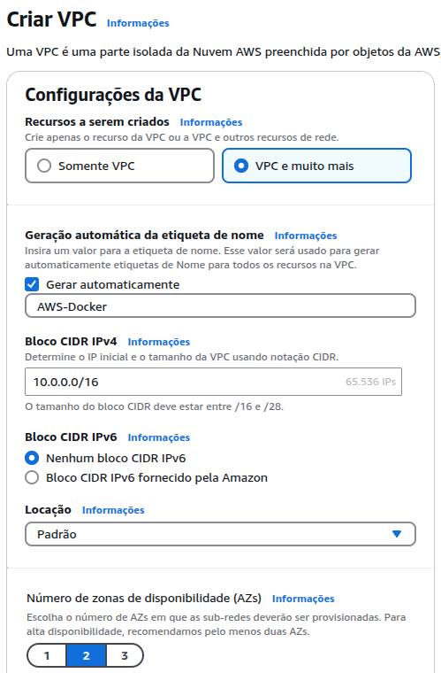

### 1.2. Criando Sub-redes Públicas e Privadas

1.2.1. No painel **VPC Dashboard**, clique em **Subnets** > **Create subnet**

1.2.2. Crie **2 sub-redes públicas** para as EC2:
- Sub-rede 1: `10.0.1.0/24`
- Sub-rede 2: `10.0.2.0/24`

1.2.3. Crie **2 sub-redes privadas** para o RDS:
- Sub-rede 3: `10.0.3.0/24`
- Sub-rede 4: `10.0.4.0/24`

1.2.4. Selecione um gateway por AZ

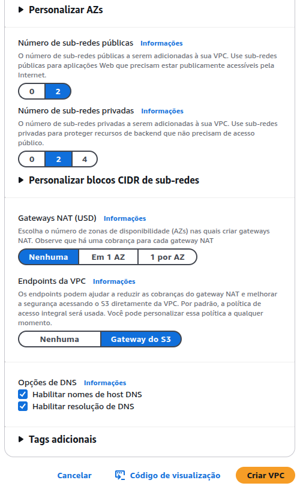

---

## 2. Criando Grupos de Segurança

### 2.1. Navegue até a seção **Security Groups**

2.1.1. Clique em **Create Security Group**
- Dê nomes apropriados para cada grupo
- Aplique as seguintes regras:

**Grupo da EC2**

Entrada:
| Tipo  | Porta | Origem                    |
| ----- | ----- | ------------------------- |
| HTTP  | 80    | **SG-LB-PROJETO-DOCKER**  |
| NFS   | 2049  | **SG-EFS-PROJETO-DOCKER** |
| MYSQL | 3306  | **SG-RDS-PROJETO-DOCKER** |

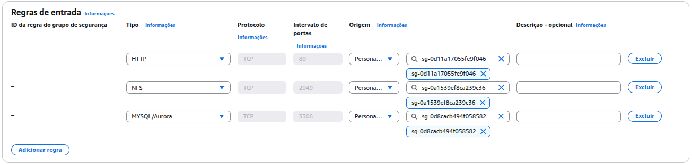

Saida:
| Tipo  | Porta | Destino                   |
| ----- | ----- | ------------------------- |
| MYSQL | 3306  | **SG-RDS-PROJETO-DOCKER** |
| NFS   | 2049  | **SG-EFS-PROJETO-DOCKER** |

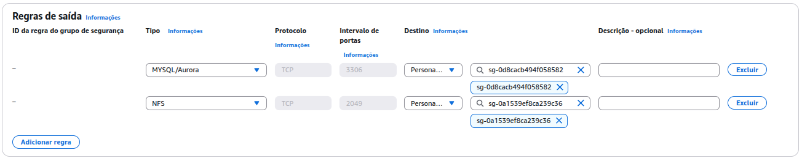

**Grupo do EFS**

Entrada:
| Tipo | Porta | Origem                    |
| ---- | ----- | ------------------------- |
| NFS  | 2049  | **SG-EC2-PROJETO-DOCKER** |

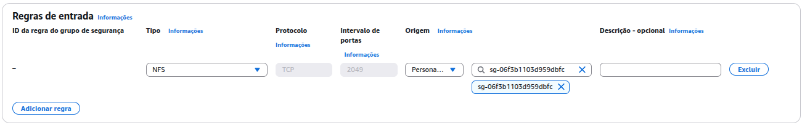

Saida:
| Tipo | Porta | Destino     |
| ---- | ----- | ----------- |
| All  | All   | `0.0.0.0/0` |

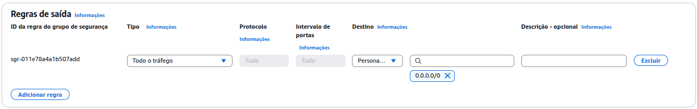

**Grupo do RDS**

Entrada:
| Tipo  | Porta | Origem                    |
| ----- | ----- | ------------------------- |
| MYSQL | 3306  | **SG-EC2-PROJETO-DOCKER** |

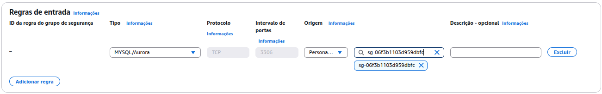

Saida:
| Tipo | Porta | Destino     |
| ---- | ----- | ----------- |
| All  | All   | `0.0.0.0/0` |

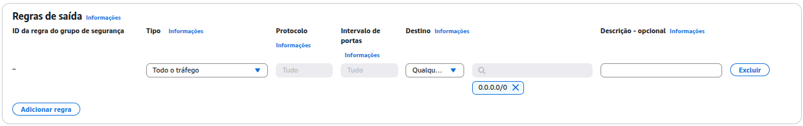

**Grupo do Load Balancer**

Regras de Entrada:
| Tipo | Porta | Origem      |
| ---- | ----- | ----------- |
| HTTP | 80    | `0.0.0.0/0` |

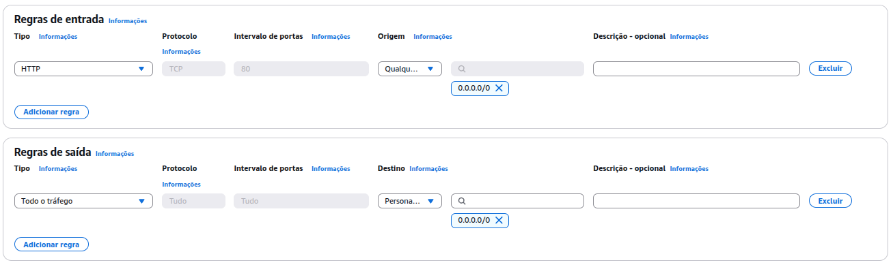

Regras de Saida:
| Tipo | Porta | Destino     |
| ---- | ----- | ----------- |
| All  | All   | `0.0.0.0/0` |

---

## 3. Configurando o RDS

### 3.1. Navegue até a seção **Aurora and RDS**

3.1.1. Clique em **Databases** > **Create Database**

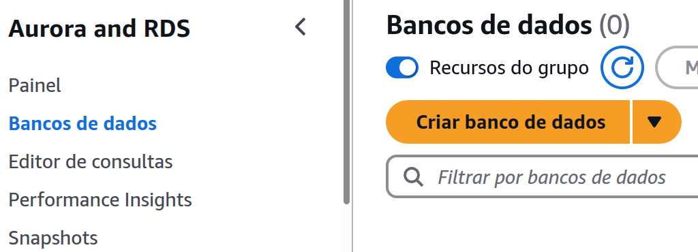

3.1.2. Escolha o mecanismo **MySQL**

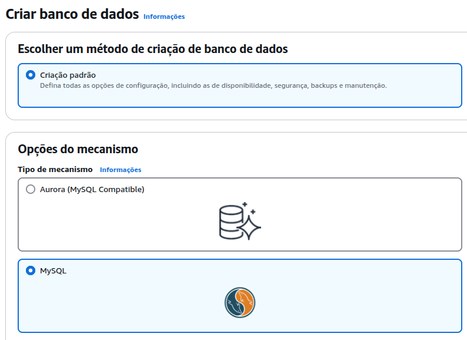

3.1.3. Utilize o modelo **Nível Gratuito**

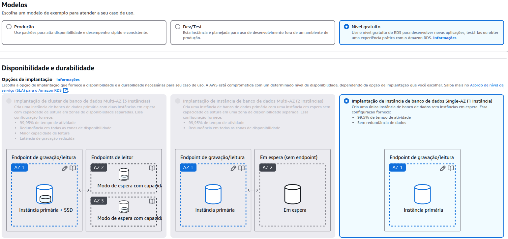

3.1.4. Configure as credenciais:
- Nome do banco
- Usuário
- Senha

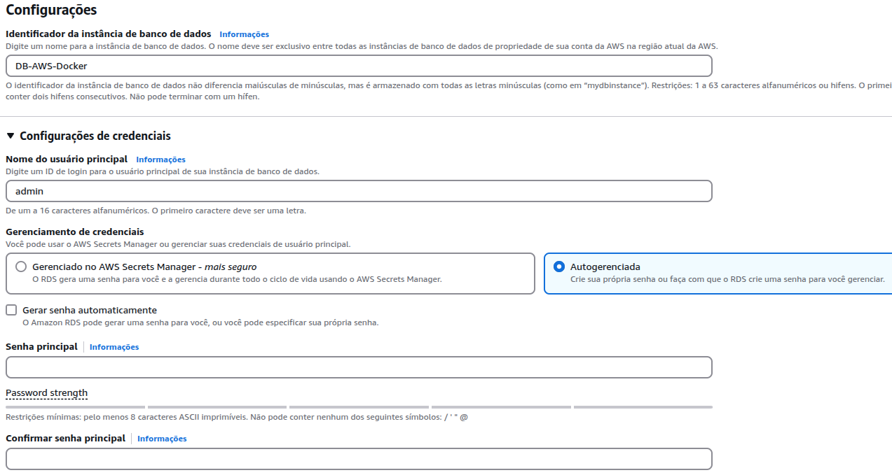

3.1.5. Configure a conectividade:
- Selecione a **VPC**
- Mantenha o acesso **privado**
- **Não** vincule a uma EC2
- Associe o **Security Group** do RDS

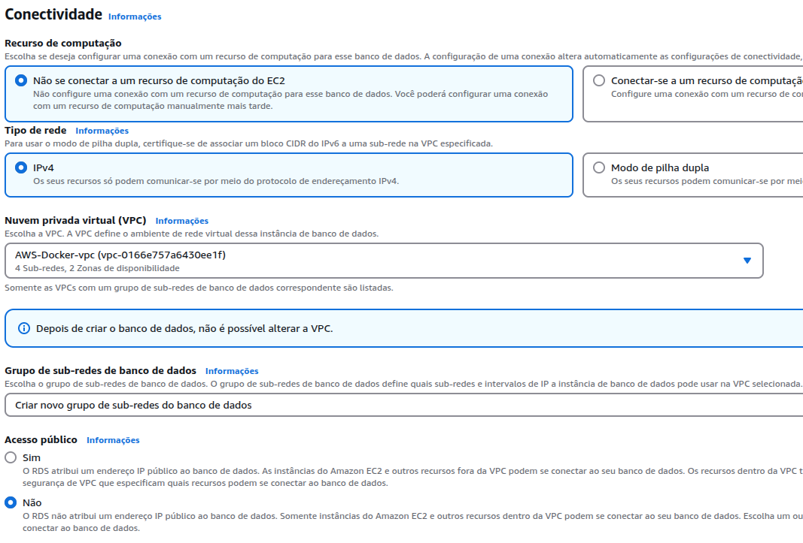

---

## 4. Configurando o EFS

### 4.1. Navegue até **Elastic File System** > **Create File System**

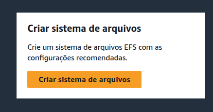

4.1.2. Configure:
- Nome do sistema
- Tipo: **Regional**

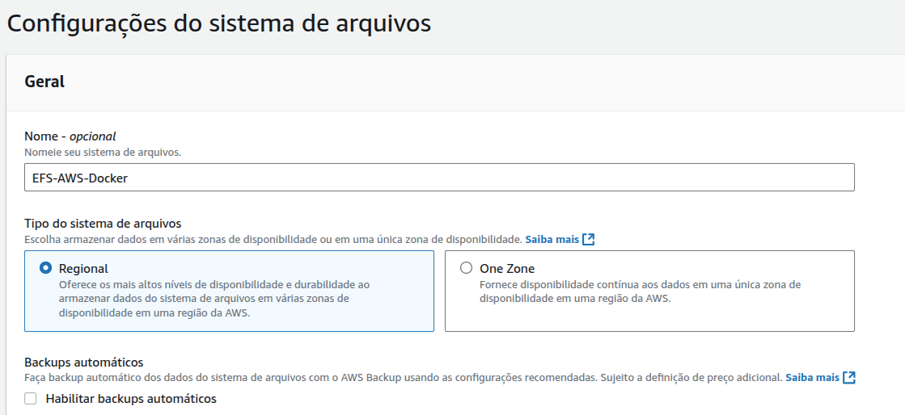

4.1.3. Configure a rede:
- Escolha a **VPC**
- Adicione zonas de disponibilidade `1a` e `1b`
- Selecione as sub-redes **privadas**
- Associe o **Security Group** do EFS

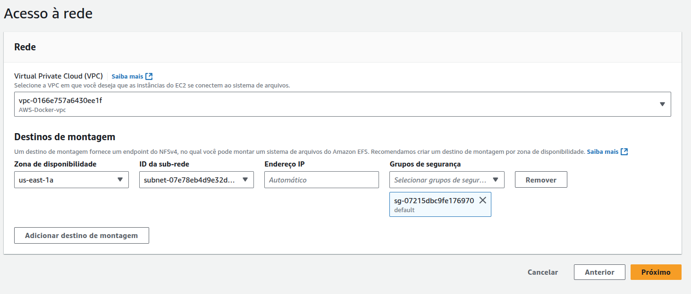

---

# 🌐 ETAPA 2: Balanceamento de Carga

## 1. Configurando o Target Group

### 1.1. Acesse a seção **Target Groups**

1.1.1. Na configuração básica:
- Tipo: **Instâncias**
- Nome do grupo
- Protocolo: **HTTP**, Porta: **80**
- IP: **IPv4**
- VPC: selecione a criada
- Versão: **HTTP1**

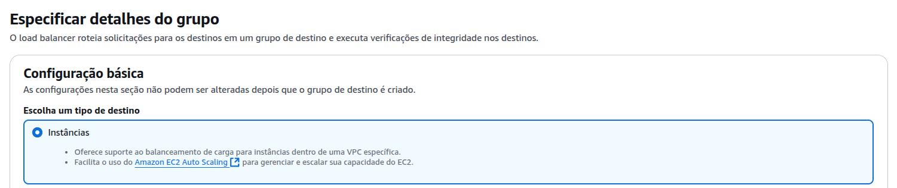

1.1.2. Mantenha a verificação de integridade padrão

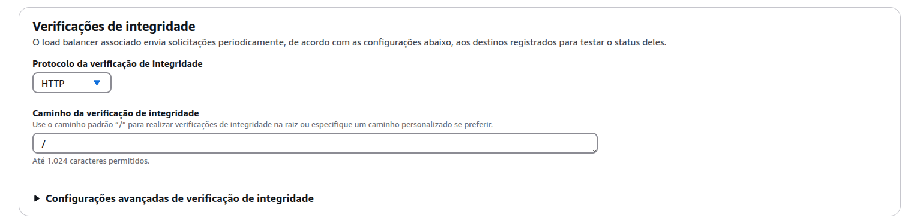

---

## 2. Criando o Load Balancer

### 2.1. Acesse a seção **Load Balancer**

2.1.1. Configuração básica:
- Nome
- Tipo: **Internet-facing**
- IP: **IPv4**

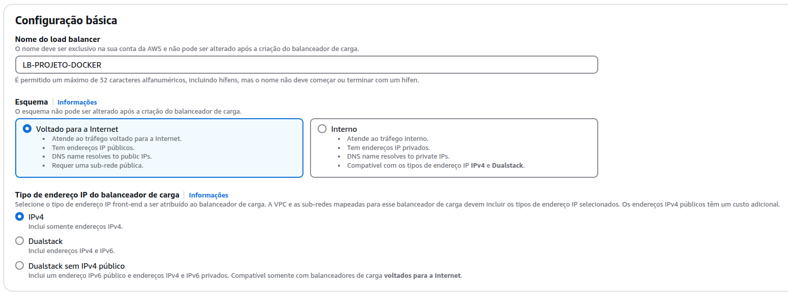

2.1.2. Mapeamento de rede:
- Selecione a **VPC**
- Zonas de disponibilidade:
  - `1a - Sub-rede Pública`
  - `1b - Sub-rede Pública`

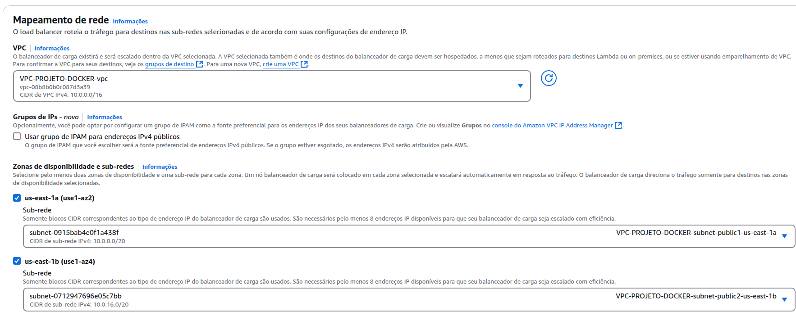

2.1.3. Security Groups e Listeners:
- Selecione o **SG do Load Balancer**
- Listener: **HTTP**, Porta: **80**
- Selecione o **Target Group** criado

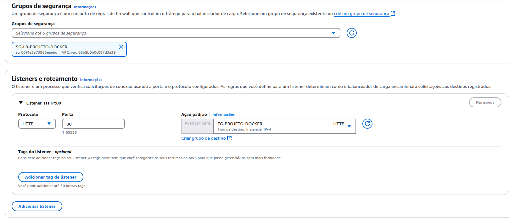

2.1.4. Adicione outro Listener se necessário:

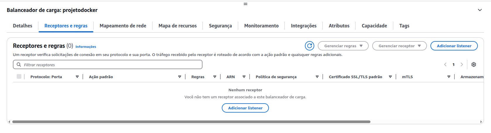

---

# 👨‍💻 ETAPA 3: Políticas de Escalonamento

## 1. Criando o Launch Template

### 1.1. Acesse a seção **Launch Templates**

1.1.1. Criação do template:
- Nome e descrição
- AMI: **Ubuntu**
- Tipo de instância: **t2.micro**

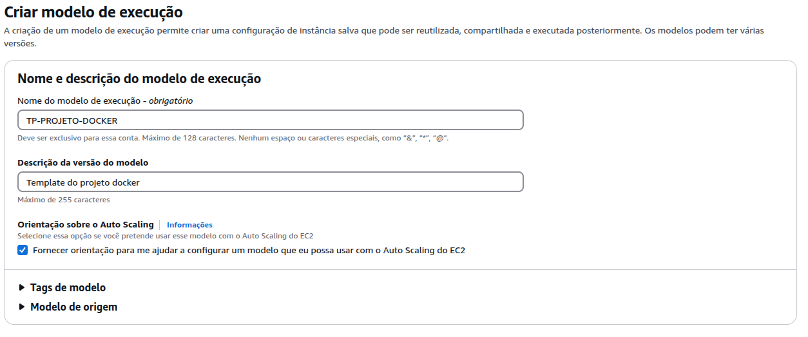

1.1.2. Configurações de rede:
- Selecione o **Security Group da EC2**

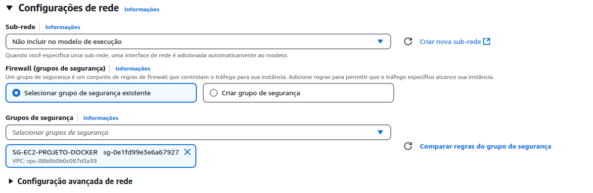

1.1.3. User Data:
- Insira o script `user_data.sh`
  - Altere variáveis conforme necessário

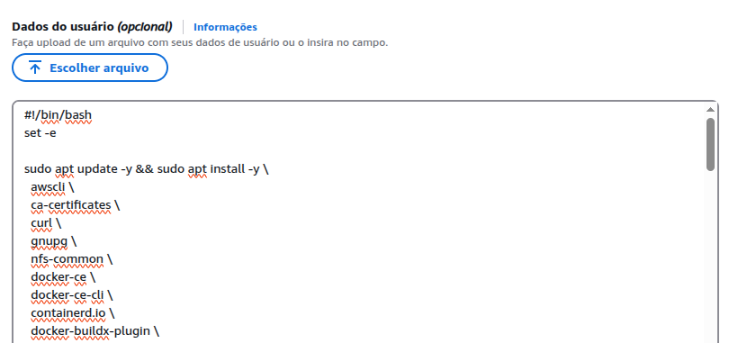

---

## 2. Configurando o Auto Scaling

### 2.1. Acesse a seção **Auto Scaling Groups**

2.1.1. Escolha o template criado:
- Nome
- Zonas de disponibilidade:
  - `1a - Sub-rede Pública`
  - `1b - Sub-rede Pública`

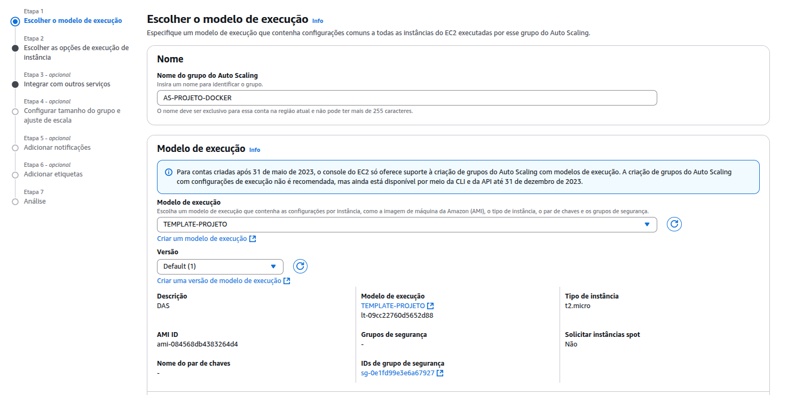

2.1.2. Integração com o Load Balancer:
- Selecione o **Load Balancer**

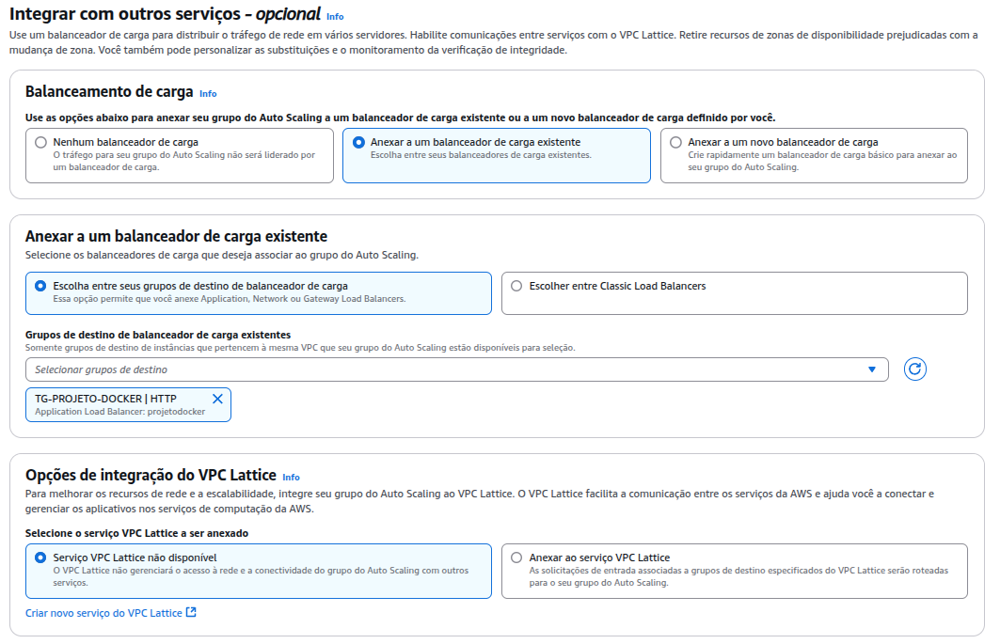

2.1.3. Ative verificações de integridade

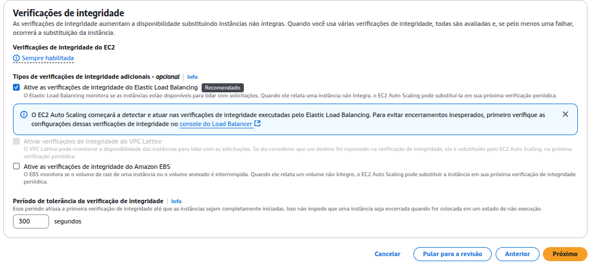

2.1.4. Defina tamanho do grupo: **2**

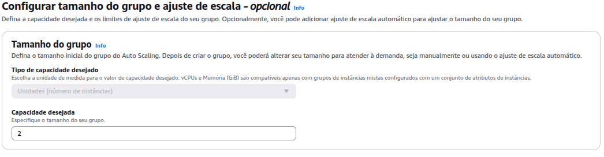

2.1.5. Configuração da política:
- Mínimo: **2**
- Máximo: **3**
- Métrica: **uso da CPU**

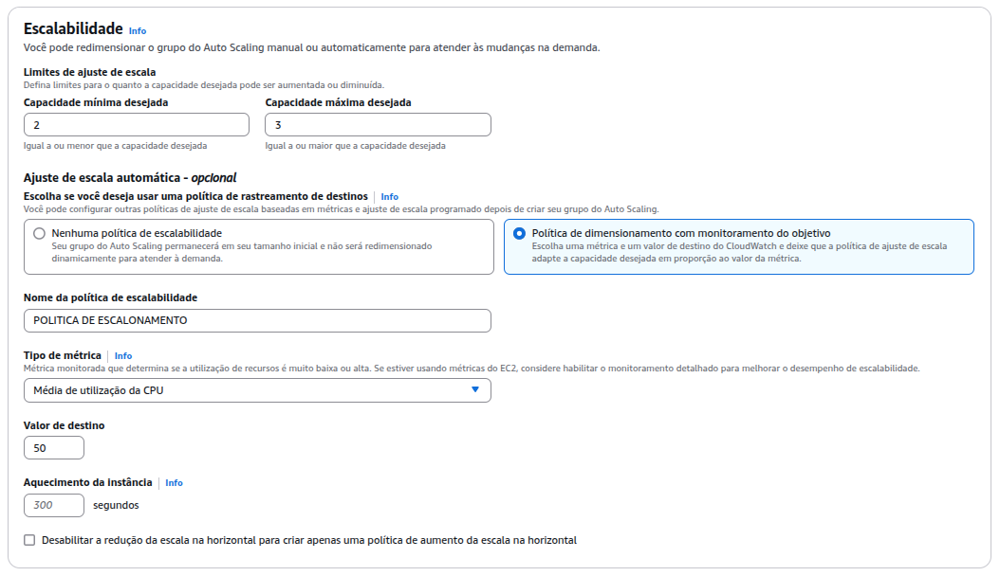

---

# ✅ ETAPA 4: Testes

## 1. Acessando o WordPress via Load Balancer

### 1.1. Acesse a seção **Load Balancer** na AWS

1.1.1. Copie o **DNS** do Load Balancer

1.1.2. Acesse no navegador:

